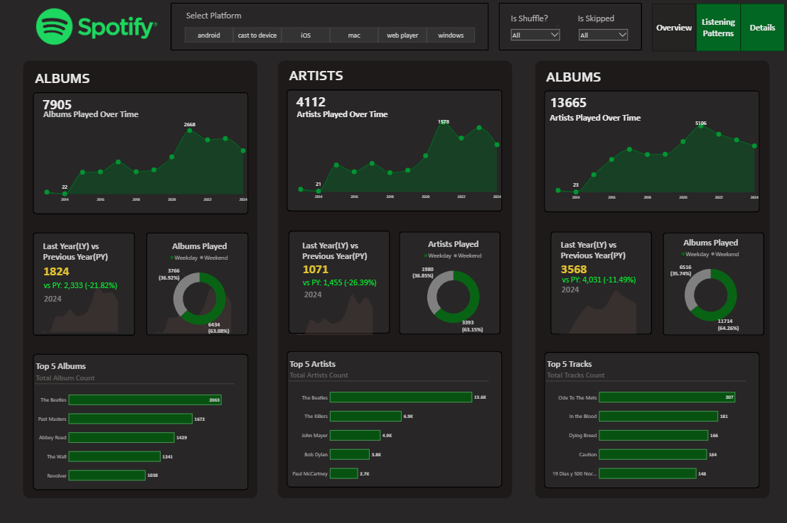
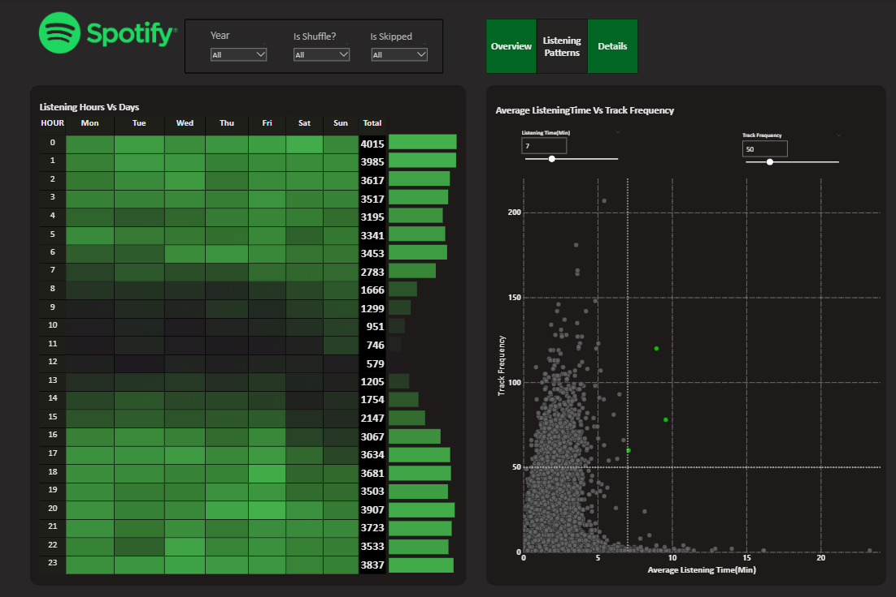
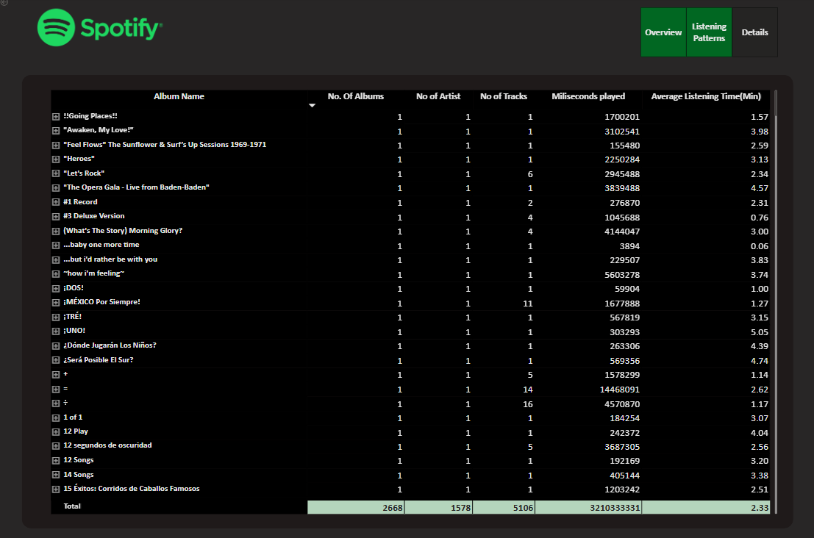

# spotify-listening-analysis

## 📌 Project Overview  
In today’s digital music era, understanding listening patterns is crucial for both users and streaming platforms.  
This project analyzes **Spotify albums, artists, and tracks data** to uncover insights into listening behavior, trends, and engagement.  

The analysis was performed step by step, covering:  
1. Requirement Gathering & Business Understanding  
2. Data Walkthrough & Connection  
3. Data Cleaning & Quality Check  
4. Data Modeling & Processing  
5. DAX Calculations  
6. Dashboard Layout & Chart Development  
7. Insights Generation  

The final output is an **interactive dashboard** that highlights key music consumption trends.  

---

## 📊 Dashboard Previews  

### Albums & Artists Analysis  

### Tracks & Listening Patterns  

### Details Grid & Drill-through  

---

## 🎯 Business Requirements & Insights  

### **Albums**  
- 📈 Total Albums Played Over Time – Track monthly & yearly album listening trends.  
- 📅 Albums Listened by Year – Identify annual habits & find min/max album counts.  
- 💥 Weekday vs Weekend – Spot listening differences by day type.  
- 🏆 Top 5 Albums – Most played albums.  
- 📊 Year-over-Year Analysis – Compare Latest Year (LY) vs Previous Year (PY).  

### **Artists**  
- 📈 Total Artists Played Over Time – Track how artist engagement evolves.  
- 📅 Artists Listened by Year – Annual habits & diversity of artists.  
- 💥 Weekday vs Weekend – Patterns of artist listening.  
- 🏆 Top 5 Artists – Most listened artists.  
- 📊 YoY Analysis – LY vs PY trends & growth.  

### **Tracks**  
- 📈 Total Tracks Played Over Time – Track listening growth over months & years.  
- 📅 Tracks Listened by Year – Yearly diversity of tracks.  
- 💥 Weekday vs Weekend – Track listening habits.  
- 🏆 Top 5 Tracks – Most popular tracks.  
- 📊 YoY Comparison – LY vs PY analysis.  

### **Listening Patterns**  
- 🕒 Listening Hours Heatmap – Peak listening times by hour & weekday.  
- 📊 Avg Listening Time vs Frequency – Scatter Plot with Quadrant Analysis:  
  - High Freq + High Time → Most engaging tracks  
  - Low Freq + High Time → Niche but impactful  
  - High Freq + Low Time → Short & frequent  
  - Low Freq + Low Time → Less popular  

### **Details Grid**  
- 🔎 Grid with Album, Artist, Track details.  
- 📂 Drill Through for deeper insights (exportable to CSV).  
- ⬇️ Drill Down / ⬆️ Drill Up for hierarchical navigation.  

---

## 🛠️ Tools & Technologies  
- **Power BI** – Dashboard creation & visualization  
- **DAX** – Calculations & measures  
- **Spotify Dataset** – Source data  

---

## 🚀 How to Use  
1. Open the `.pbix` (Power BI) file or refer to the included presentation.  
2. Explore the dashboards (Albums, Artists, Tracks, Listening Patterns).  
3. Use filters, drill downs, and drill throughs to analyze specific insights.  

